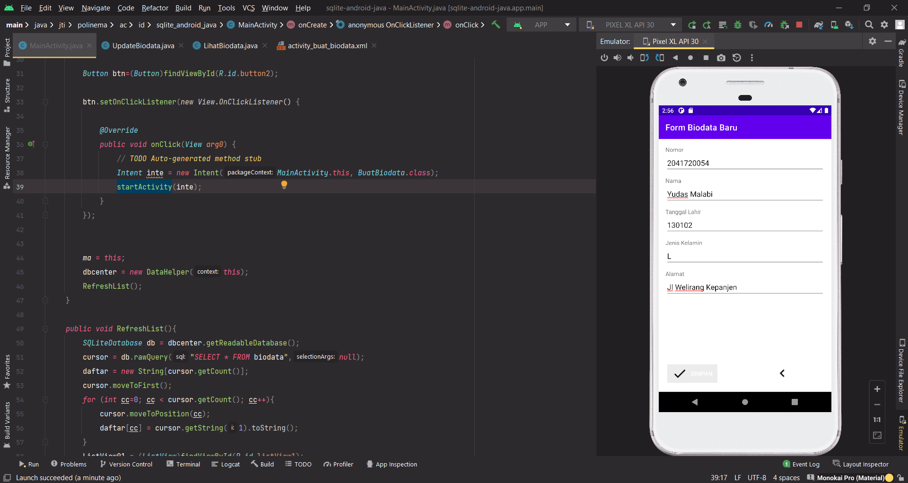
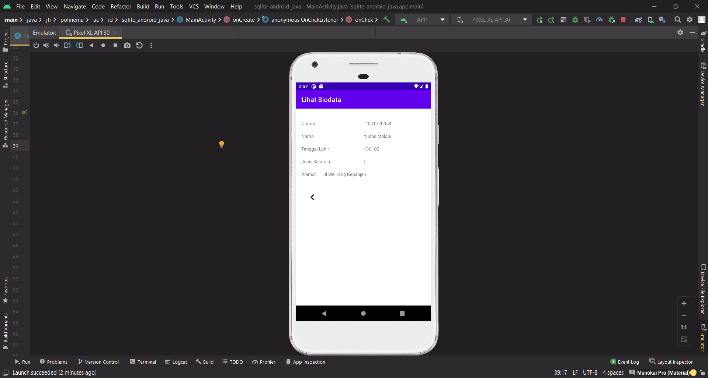
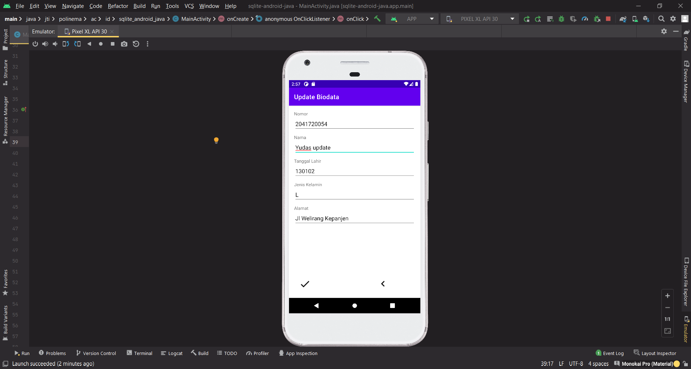
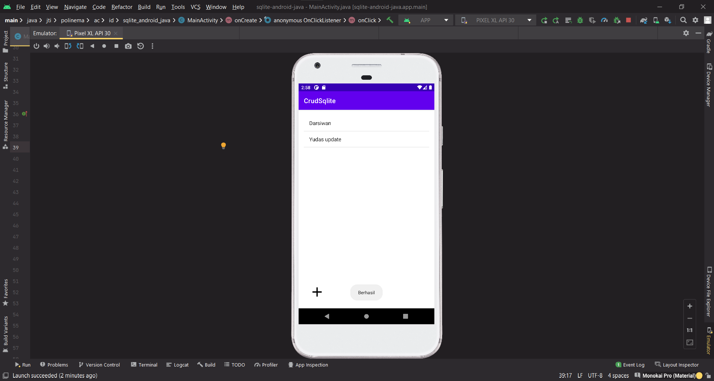
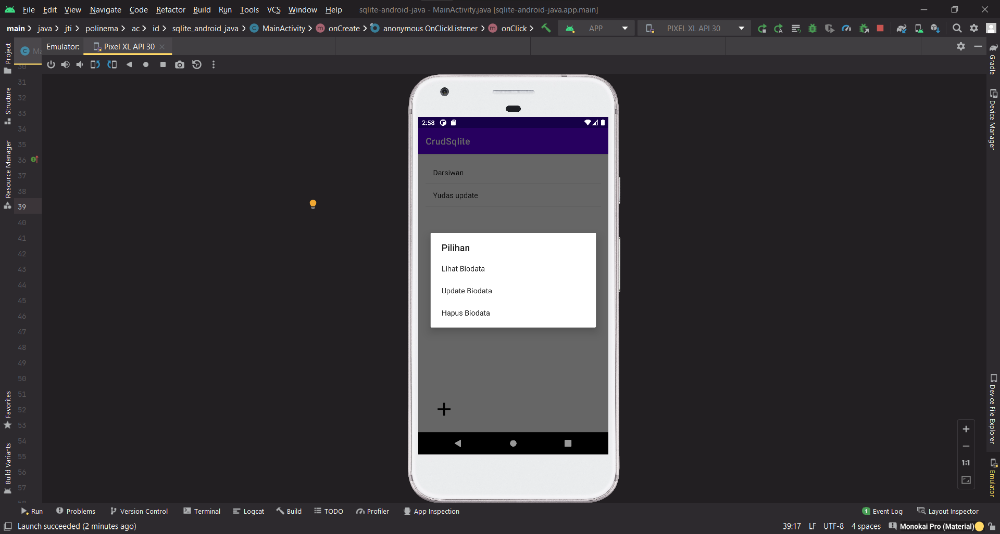

# Tugas Praktikum SQLite

Buat project baru berdasarkan code CRUD Sqlite tsb. 

- Kumpulkan ke GitHub dg nama repo: sqlite-android-java

- Kumpulkan link repo tsb ke LMS

## Screenshot Hasil Praktikum

- Tambah data 

- Lihat data

- Update data

- Hapus data & menu data

